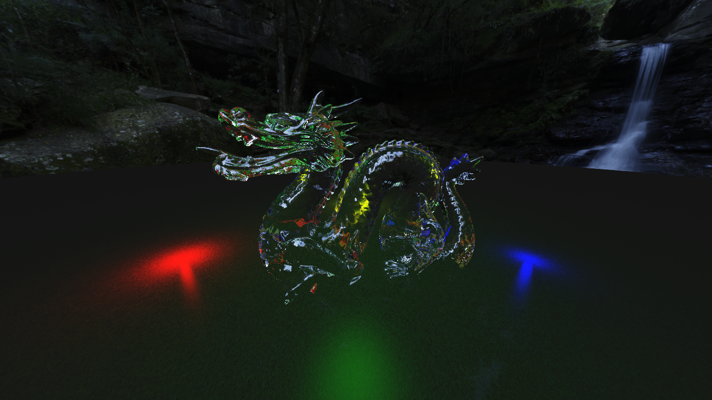
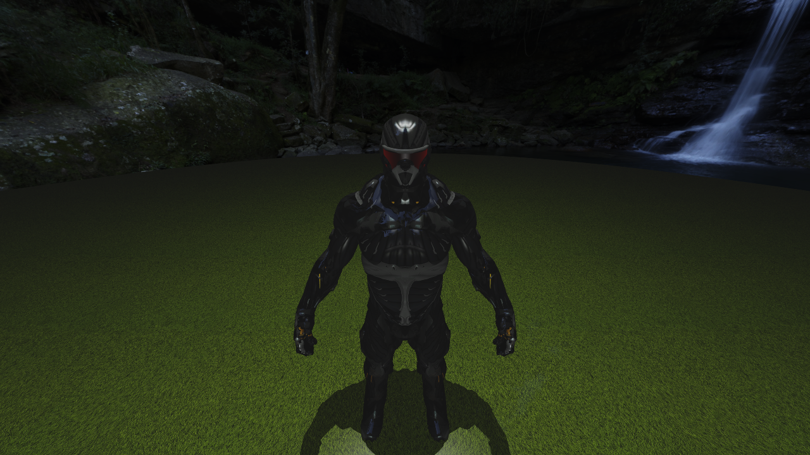
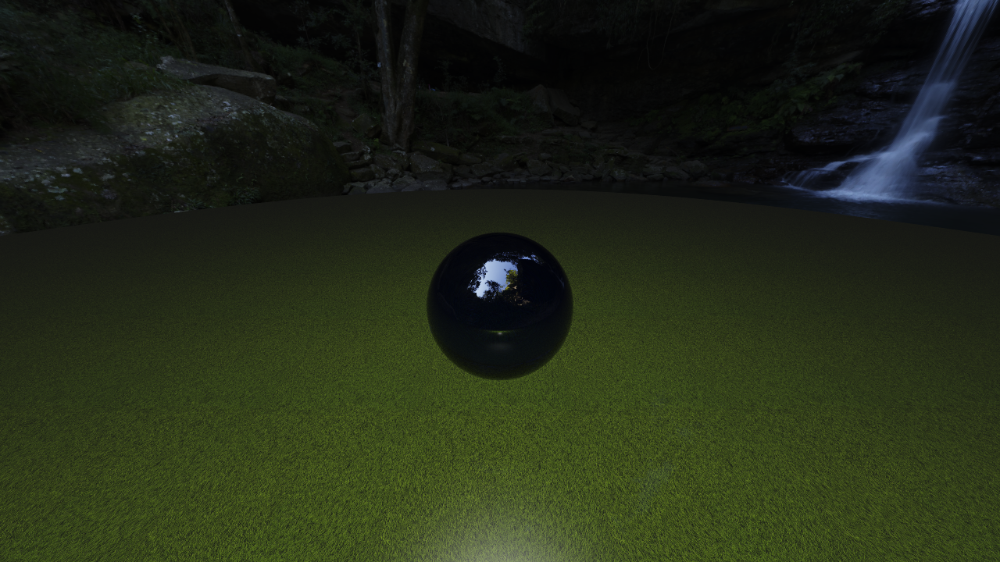

# About this

This is a relatively simple whitted style ray tracer boasting the following features:
* Various primitives: Box, Disc, Plane, Rectangle, Sphere, and Triangle.
* Model loading and rendering.
* Texture loading and sampling, supporting everything stb\_image supports.
* Frustum culling.
* Camera with aspect ratio and FOV.
* BVH acceleration structure for both the scene and models.
* Programmable shaders.
* Per object materials.
* Krzysztof Narkowicz style ACES Filmic tone mapping.
* Point lights.
* Anti-aliasing, up to 16 rays per pixel.
* Chunked multi-threading.
* Per object transforms, for position, rotation, and scale.
* Bump mapping, and specular mapping.

## Screenshots



This is Georgia Tech's Chinese Dragon rendered as a glass material and 4 point lights for style points. It took roughly 16 minutes to render with 16x AA.



This is Crytek's Crysis 2 Nano Suit rendered with bump mapping, specular mapping, and light reflection.



This is a sphere rendered with volumetric absorbtion, which code is in the abandoned VolumetricAbsorbtion branch. The branch is abandoned because it's pretty much a hack on the current architecture, which doesn't support giving the information volumetric absorbtion needs.

# Rough TODO/upcoming

These are the things I want to do or add, in no particular order, before I consider this project finished:
* Get rid of the useless disc primitive.
* Remove Color and simply use vectors instead.
* SIMD processing of multiple rays at once.
* Custom model format and loading, including conversion from OBJ.
* Post processing shaders.
* Pre processing shaders.
* Shadows for transparent objects.
* Volumetric absorbtion.
* Ray marched volumetric objects.
* Different and more accurate light types, such as area lights, emissive objects, directional lights, and point lights.
* Path tracing.
* Many many many optimizations.

# How to build

After cloning run `git submodule init && git submodule update` to fetch the `LotusWaf` dependency, which is needed for building.

## Linux (X11)

Install the following (development) packages:
* glfw-3
* libglm
* clang
* python3

```
./waf configure --target-configuration release
./waf
```

To compile with GCC instead, add `--toolset linux_x86-64_gcc` to the configure command line.

## Linux (headless)

Install the following (development) packages:
* libglm
* clang
* python3

```
./waf configure --target-configuration release --without-glfw-3 --without-OpenGL
./waf
```

To compile with GCC instead, add `--toolset linux_x86-64_gcc` to the configure command line.

## Windows

### MSYS2

Install MSYS2 and the following packages:
* git
* mingw-w64-x86_64-python3
* mingw-w64-x86_64-clang OR mingw-w64-x86_64-gcc
* mingw-w64-x86_64-glm
* mingw-w64-x86_64-glfw

To install a package in MSYS2, you use the `pacman` command. Following is an example command to install all packages for a clang build:
```
pacman -S git mingw-w64-x86_64-python3 mingw-w64-x86_64-clang mingw-w64-x86_64-glm mingw-w64-x86_64-glfw
```

Open an MSYS2 MINGW64 terminal and navigate to where you want to clone the project, and initialize the submodules.

To compile with clang, run the following command:
```
./waf configure --target-configuration release
```

To compile with gcc, run the following command:
```
./waf configure --target-configuration release --toolset windows_x86-64_gcc
```

After configuration run `./waf` to actually compile the project.

### MSVC

Install the following software:
* [Python 3](https://www.python.org/downloads/windows/)
* [CMake](https://cmake.org/download/)
* [Git for Windows](https://git-scm.com/download/win) (Any git client will work, this is just the most common one.)
* [Visual Studio](https://visualstudio.microsoft.com/downloads/) (Tested with VS2017 Community.)
  * Make sure to select the C++ feature set, and make sure any Windows SDK is included.

This guide assumes you install your libraries into D:\MSVC\$Configuration\ (e.g. Release), for the purpose of this guide we use a release configuration.

After installing the required software, download, [GLFW](https://github.com/glfw/glfw/).  
Configure GLFW in `RelWithDebInfo` mode, and install it using `cmake --build . --target install`, as CMake doesn't copy the PDB, manually copy `src\glfw3.pdb` to `D:\MSVC\Release\bin\`.

Next download [GLM](https://github.com/g-truc/glm), navigate to the source tree and copy the `glm` folder `D:\MSVC\HeaderOnly\include`.

Next up open an `x64 Native Tools Command Prompt for VS 201*` (where * is either 7 or 9), and make sure the compiler can find our libraries by using the following commands:  
This part assumes Python is installed in `C:\Python36\`, edit where necessary.
```
set PATH=%PATH%;C:\Python36;D:\MSVC\Release\bin
set INCLUDE=%INCLUDE%;D:\MSVC\Release\include;D:\MSVC\HeaderOnly\include
set LIB=%LIB%;D:\MSVC\Release\lib
```

Now navigate to the source folder, and make sure to initialize and up the submodules.  
Now we can compile using MSVC with the following commands:
```
python ./waf configure --target-configuration release --toolset windows_x86-64_msvc
python ./waf
```

# Running it

Next run it by executing `build/RayTracer` from this directory.
After rendering has completed, a window will pop up showing the render, if configured.
In all configurations, the render will output to a png in the working directory.
